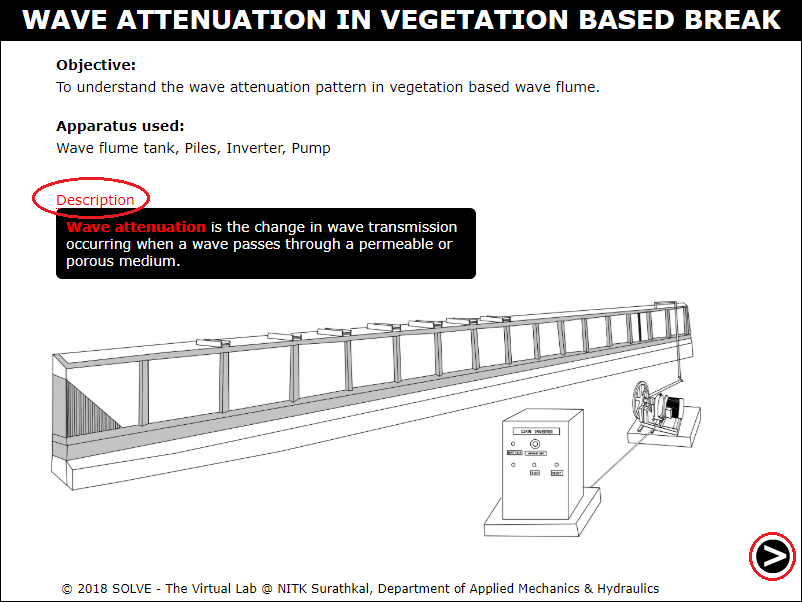
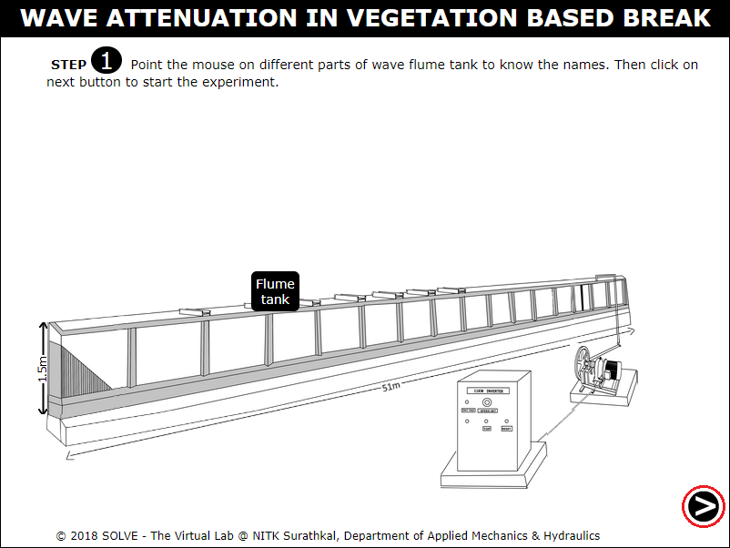
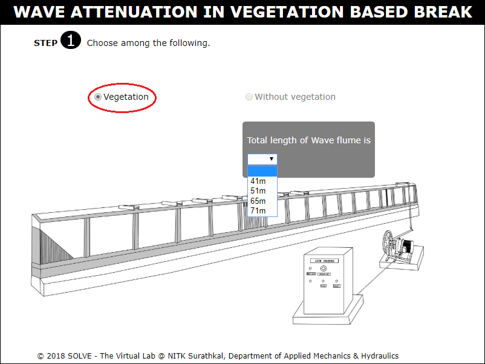
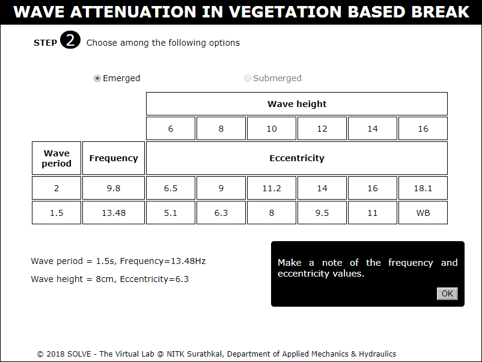
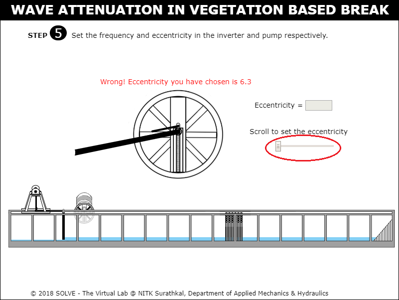
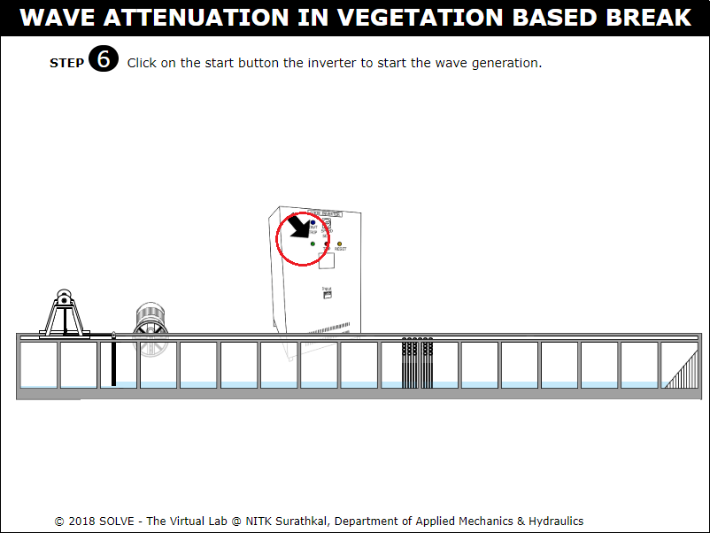
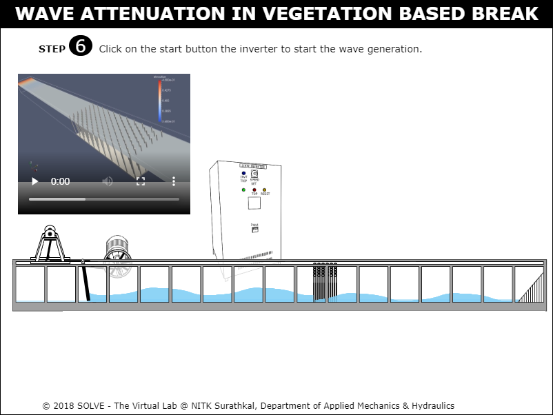
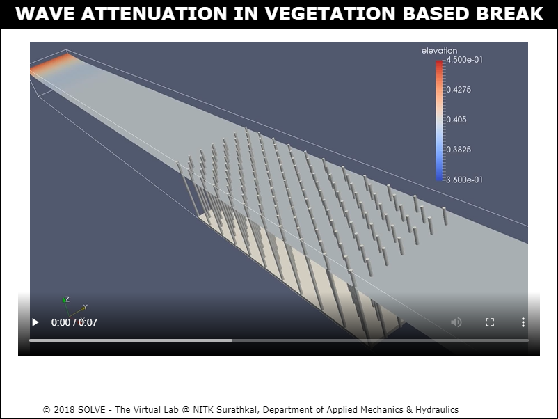

#### These procedure steps will be followed on the simulator

1. Click on Wave attenuation in Vegetation Based Breakwater, go through the description and then click on NEXT button shown at the bottom right corner. 
 

2. Hover mouse pointer on the experimental setup to know the naming of the setup. 
 

3. Now select the answer from the given option and click on NEXT button. 
 

4. Again select the condition to carry out the test, note the frequency and eccentricity value from wave calibration table and then click NEXT button. 
 

5. Now set the selected frequency using speed knob. 
 

6. Set the eccentricity by adjusting the knob. 
 

7. Click on "ON" button to switch on the machine. 
 

8. View the wave attenuation pattern in the wave flume and click on zoom button to view in zoomed view. 
 

9. View the wave attenuation pattern on zoomed view. 
 
